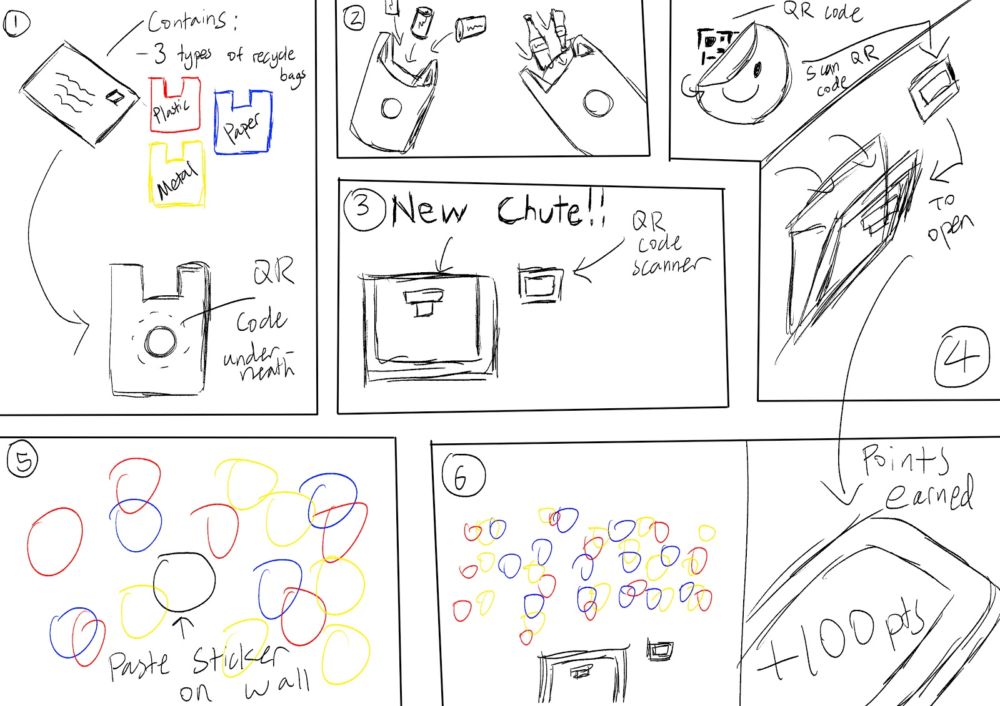
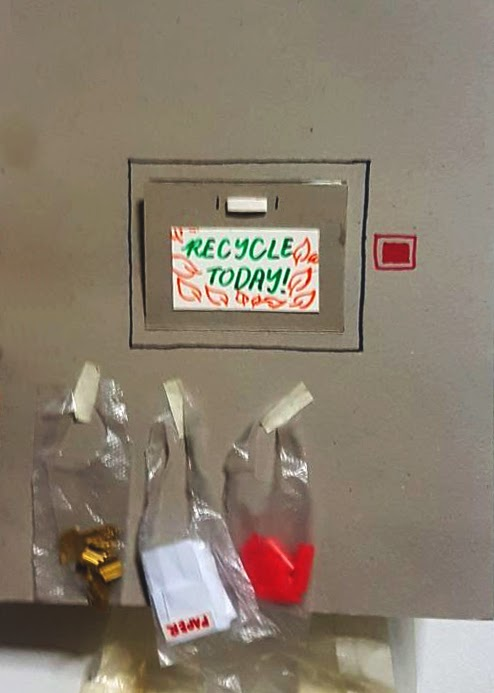

In our second year of study in Singapore Polytechnic (SP),
we are required to take a module called Social Innovation Project (SIP). 

SIP is a module to teach us the design thinking process. We focus on a particular group in the society and develop an appropriate solution/product to help them using the design thinking process. We had to conduct interviews, create a persona from the data we collected, make a prototype based on the persona, showcase our prototype in a gallery walk, and finally refine our prototype for our final presentation based on the feedback we received. Which is a pretty tedious process considering we only have 2 hours per week together.

At the start my group struggled as not all of us are present in each class due to conflicting schedules and the influenza, but we many to pull through the project pretty well by updating each other regularly in our group chat, tracking the project progress on Trello, and also meeting when we're free. 

This is our final prototype, a community campaign paired with a smart recycling rubbish chute to promote recycling for HDB residents and reduce recycling contamination rates.

The most memorable thing about this project was how well a cross-disciplinary group can work together for a common goal. Our concept sketches and prototyping was done by Design students, research was done by Business students, and there's me who spent 3 days to make a program using Speech-to-Text(STT) to transcribe down the recorded interviews. However the program was pretty much rendered useless when one of our prospective ended going billingual for the interview, not to mention transcribing the interviews was a minute component of the whole project. (to add insult to injuiry I lost the source code) 

At the end of the day my personal takeaway from the module is relatively simple, it's amazing how crazy our ideas can be if we take the feasibility of the project as a student out of the equation and instead view it as we have the money and power to carry the project out. We can truly think out of the box that way, something that I find it relatively hard to do based on my student, engineer mindset. It's just like the adage that goes "Don't limit yourself".